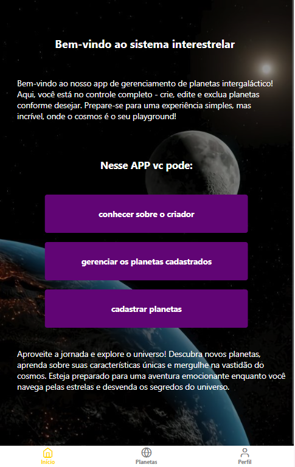
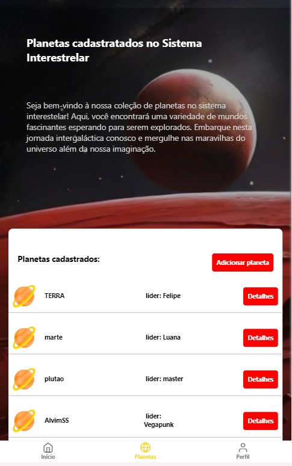
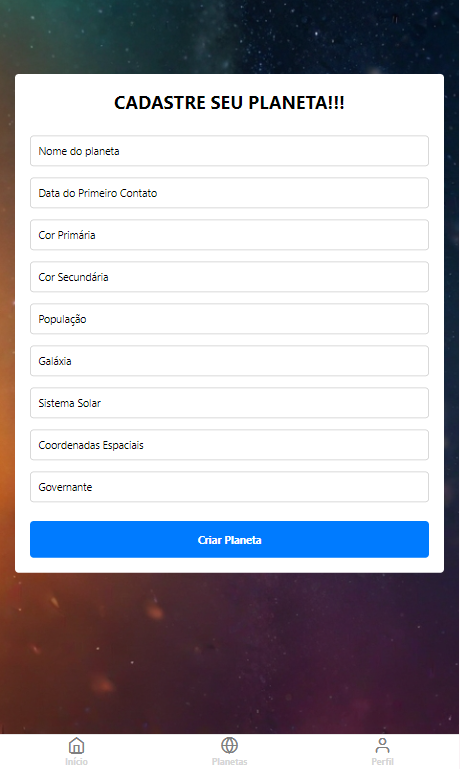
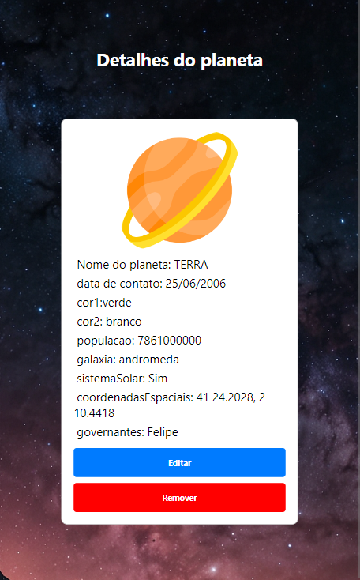
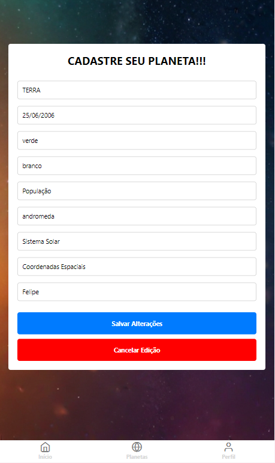

<h1 align="center">Projeto Criação Planetária</h1>

Este projeto tem como objetivo criar um sistema de cadastro e visualização de planetas, permitindo aos usuários explorar informações sobre diferentes corpos celestes.

---

<h3 align="center">Home</h3>

  

Página inicial do projeto, onde os usuários são recebidos e podem navegar para outras seções.

---

<h3 align="center">Página de Planetas Cadastrados</h3>

  

Página que exibe os planetas cadastrados no sistema.

---

<h3 align="center">Página de Perfil do Criador</h3>

  

Página que mostra o perfil do criador do projeto.

---

<h3 align="center">Página de Criação de Planetas</h3>

  

Página onde os usuários podem criar novos planetas.

---

<h3 align="center">Página de Detalhamento de Planetas</h3>

  

Página que exibe detalhes específicos de cada planeta.

---

<h3 align="center">Página de Edição</h3>

  

Página onde os usuários podem editar informações de um planeta existente.

